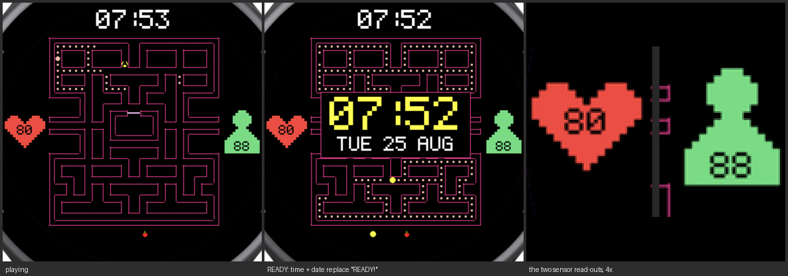
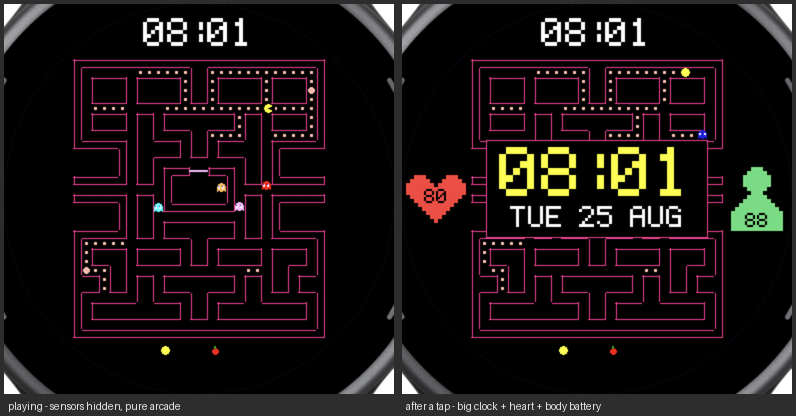
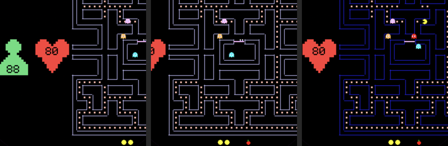
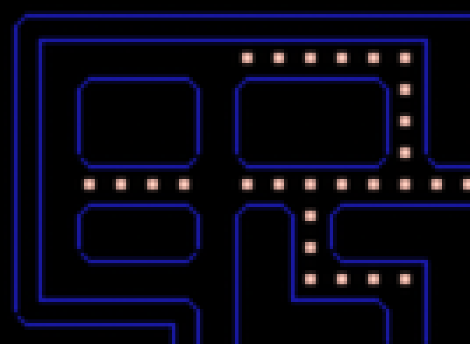

# Arcade Watch

**Four** self-playing arcade games for the Garmin **vívoactive 5**, where the
clock *is* the game furniture: the time sits where the arcade puts the score,
and every time a life is lost or a round begins, the arcade's `READY!` is
replaced by the time and date in big pixel type.

Nobody plays any of them. They run themselves, forever — the watch is
permanently in *attract mode*.

| swipe up / down | change game |
|---|---|
| swipe left / right | recolour |
| tap | peek at heart rate and Body Battery for 5 s |
| BACK | exit |

**The games.** A maze chase with the authentic 28×31 playfield and the real
1980 ghost targeting; **Space Invaders**, whose formation speeds up as it
thins out exactly because the original ran out of sprites to move; **Breakout**,
whose wall is fitted to the circle so each row is only as wide as the bezel
allows; and **Asteroids**, which wraps *radially* — leave the bezel anywhere
and you re-enter diametrically opposite, which suits a round screen far better
than the cabinet's rectangular wrap.

> A homage to the 1980 arcade classic, built for fun on a personal
> smartwatch. Not affiliated with, endorsed by, or connected to Bandai Namco
> Entertainment. No original game code or assets are used: the maze, the
> font and every sprite here are reconstructed from scratch, and the tools
> that generate them are in `tools/`.



## Build & install

You need the [Connect IQ SDK](https://developer.garmin.com/connect-iq/sdk/)
and your own signing key. The key is deliberately **not** in this repo — it is
a private key, and yours should stay yours:

```bash
openssl genrsa -out developer_key.pem 4096
openssl pkcs8 -topk8 -inform PEM -outform DER \
        -in developer_key.pem -out developer_key -nocrypt
```

(Or in VS Code with the Monkey C extension: `Monkey C: Generate Developer Key`.)
Then:

```bash
tools/deploy.sh          # builds bin/ArcadeWatch-vivoactive5.prg and pushes it
```

If the watch mounts as `/Volumes/GARMIN` it copies itself into `GARMIN/APPS/`.
Otherwise drag `bin/ArcadeWatch-vivoactive5.prg` into `GARMIN/APPS/` with Android
File Transfer. It appears in the **app list** as **Arcade** (not the watchface list) — see
"Why a watch-app" below.

Regenerating the baked assets (only needed if you edit the maze or the font):

```bash
python3 tools/gen_maze_mc.py    # tools/maze.py    -> source/MazeData.mc
python3 tools/gen_icons_mc.py   # tools/icons.py   -> source/IconData.mc
python3 tools/gen_sprites_mc.py # tools/sprites.py -> source/SpriteData.mc
python3 tools/gen_invaders_mc.py # tools/invaders.py -> source/InvaderData.mc
python3 tools/gen_fonts.py      # tools/pixfont.py -> resources/fonts/*
python3 tools/gen_icon.py       # launcher icon
```

Run them from the project root, not from inside `tools/` — they write to
paths relative to the root.

## Launching it quickly

Hunting through the app list gets old, so there are two faster routes:

- **The glance.** Swipe up or down from the watch face and the app appears as
  a card in the carousel; tap it to launch. That is what `source/Glance.mc`
  provides. It measures 6.4 KB of its 64 KB budget, so staying
  dependency-free was the right call.
- **A hot key.** On the watch: **Settings ▸ System ▸ Hot Keys**, pick a
  button and a press-and-hold action, and assign Arcade Watch. One long press
  from anywhere and it opens — no swiping at all.

The glance is deliberately self-contained: no `Theme`, no game state, no font
resources, not even a string resource. It gets its own compile scope with a
**64 KB** budget against the watch-app's 768 KB, and that scope is far more
restricted than it looks — see the battle scars.

## What's on screen

```
 time-as-score  ── the clock, where the arcade draws the score
 the maze       ── the real 28x31 arcade playfield, 240 dots + 4 pellets
 centre panel   ── on READY / GAME OVER: big time + date, held ~4 s
 bottom         ── lives (Pac icons), level (fruit)
```

**Tap** to peek: the big clock comes up along with heart rate (in a filled
pixel heart) and Body Battery (in a pixel bust), and all three go away again
after 5 s. The read-outs are hidden the rest of the time so the playing face
stays pure arcade — nothing on it that the cabinet did not have. The game
keeps running underneath; there is nothing to freeze, and the hero carrying on
around the panel is half the charm. A second tap dismisses it early, and
during READY a tap still skips the dwell as before.



**Swipe sideways** to recolour and **up or down** to change game — either way
the whole screen slides off and the new one follows it in. Six colours, and
the choice survives closing the app. **Tap** skips the clock dwell.



### Getting out (and staying in)

Small children swipe at this thing constantly, so leaving is deliberately
narrow. The awkward part is that a touchscreen Garmin does not deliver every
swipe to `onSwipe`: some directions become *behaviours* first — swipe-right
becomes BACK, vertical swipes can become next/previous page — and those never
reach `onSwipe` at all. That is why a right-swipe used to quit the app.

So `PacDelegate` catches every one of those routes, consumes it, and turns it
into the same recolour. Consuming BACK creates the opposite risk — an app you
cannot quit — so there are two independent exits:

- **the physical BACK button**, which arrives as `onKey(KEY_ESC)` before it is
  ever converted into a behaviour, and
- **a double BACK** within 1.2 s, which always exits no matter how the device
  routes it.

A child swiping randomly trips neither.

## Sensors

| | |
|---|---|
| Heart rate | `Activity.currentHeartRate` is null outside a recorded activity, so the live source is the newest sample of `ActivityMonitor.getHeartRateHistory`. |
| Body Battery | `SensorHistory.getBodyBatteryHistory`. **Verify this one on the watch:** Body Battery is *not* listed in the vívoactive 5's `sensorHistory` device profile (which advertises only heartrate and pulseox), yet the call does answer in the simulator. It is made behind `has` guards and degrades to `--`. |

Both are capped at three characters — which is what fits inside the icons,
and why the Body Battery figure carries no `%`. They are only polled while
the peek is on screen, and a tap forces a fresh reading rather than showing
whatever was last cached.

The icons are drawn live rather than baked into the maze buffer. That costs
31 fill calls, but only during the 5 s they are visible — the buffer is the
wrong home for something that is usually hidden.

## Every game is different

`Math.rand()` starts from the same state every launch, so the first version
replayed the same game identically each time you opened it. Three things
changed:

- the RNG is seeded from the clock at startup;
- the hero picks his next dot at random from the near candidates the flood
  already found, rather than always the single closest — and *sticks* with
  that choice until he eats it, because re-rolling at every junction just made
  him dither;
- ghost release times and the scatter/chase schedule are jittered by up to a
  second, which changes where each ghost is when he reaches a junction.

Measured over two runs: identical for the opening READY dwell, diverging the
moment play starts (frame 111), with the dot-eating order splitting after 36
bites.

## Why a watch-app and not a watchface

A Garmin watchface gets `onUpdate` **once per second** even in high-power
mode, so the hero would advance one tile per second. A watch-app drives its
own `Timer` at 15 fps. (A watchface is also capped at 128 KB against a
watch-app's 768 KB.) The tradeoff is that you launch it rather than it
always being there.

## Wall corners

The outline is the boundary between wall and open tiles, inset into the wall
side, with collinear edges merged into runs at build time. The trap is the
run *ends*: a run spanning whole tiles overshoots its corner by one inset in
both directions, so two runs meeting at a corner cross in a small plus sign —
visible on the watch as ragged, mismatched joins.

So each end carries the sign of the inset to apply: pulled **in** at a convex
corner, so it lands exactly on the perpendicular run; pushed **out** at a
concave one, so it reaches the run coming the other way. Every block then
closes as an exact rectangle.

On top of that, the 130 convex corners are chamfered, which is what gives the
arcade's rounded walls. At a 1 px stroke a rounded corner has no room to be a
real arc — `dc.drawArc` left stray disconnected pixels — so each is a single
diagonal, which rasterises predictably and reads as a curve at actual size.
One-tile-thick walls come out as lozenges, exactly like the cabinet.



## How it fits a round screen

The maze is a 28:31 rectangle and the screen is a 390 px circle, so the
binding constraint is the maze's *diagonal*, not its width. Sizing the cell
from that gives **9 px per tile — and zero clipped tiles**. It was worth
measuring rather than guessing: 11 px loses 44 tiles and 13 px loses 184,
and what they lose is the top and bottom corridors, which are real
gameplay. `tools/preview_layout.py` renders the comparison.

## The AI

Ghosts use the **real 1980 targeting rules** — Blinky chases Pac's tile,
Pinky aims four tiles ahead (including the original's overflow bug, where
facing UP also shifts the target four left), Inky reflects Blinky through
the tile two ahead of Pac, and Clyde chases only past eight tiles and
otherwise flees to his corner. They reverse on every scatter/chase switch
and never turn back otherwise. Ties break UP, LEFT, DOWN, RIGHT.

The mode schedule is the arcade's too: scatter 7 s → chase 20 s → scatter 7 s
→ chase 20 s → scatter 5 s → chase 20 s → scatter 5 s → chase forever, with a
power pellet giving 6 s of frightened at level 1, flashing white for the last
two. Eaten ghosts become eyes and sprint home. Every one of those durations is
jittered by up to a second here, which is part of why no two runs are alike.

The hero floods the maze breadth-first from his own tile. That single flood
answers everything at once: nearest dot, nearest pellet, and — since the
flood measures distance *through corridors* — how close each ghost really is
and which way it lies. When something is actually on him a second, small
flood from the threatening ghost gives him an escape map.

Measured: he clears all 244 dots in about 90 seconds.

## Performance notes (measured on the SDK 9.1 simulator)

The vívoactive 5's `onUpdate` watchdog trips around 700 draw calls, and
there is a separate one on execution time. Both bit during development:

| | |
|---|---|
| Wall outlines, one line per tile edge | 732 calls — **over budget** |
| …pre-merged into runs at build time | **172 calls** |
| Full maze repaint (walls + corners + 240 dots) | 544 calls, into an offscreen buffer |
| Steady-state frame | ~60 calls (one blit + five sprites + text) |
| Eating a dot | one black rect punched into the buffer |
| AI flood, first version | tripped the watchdog outright |
| …after junction-only + capped radius | median **5 ms**, worst **9 ms** of a 66 ms frame, on ~6% of frames |
| Sensor icons | 15 + 16 runs, drawn live but only during a 5 s peek |
| Invader formation | 55 sprites x 9 runs = ~495 calls; the reason they are 6x5 and not 11x8 |
| Breakout / Asteroids | ~42 and ~80 calls |
| Swipe slide | two buffers, whole scene drawn twice for 10 frames |
| Memory | 97 KB of 768 KB with all four games and both buffers |
| `.prg` | 150 KB |

## Seeing it without a watch

The app can **stream its own state**: set `Game.TRACE = true`, run under
`monkeydo`, and every frame prints a compact line with all five actors, the
game state and the AI cost. Then:

```bash
python3 tools/replay.py /tmp/pactrace.log   # -> tools/replay_sheet.png
```

`tools/render.py` is a pixel-exact mirror of `PacView.mc` — same cell size,
same origins, same *integer division* — so a replay shows what the watch
shows. This is how the wall bug below was caught.

Screenshots of the simulator itself need macOS **Screen Recording**
permission; `screencapture` silently returns an all-black image without it.
Synthesising *input* additionally needs **Accessibility**, which is a separate
grant — without it `CGEvent` posting is dropped on the floor and no gesture
ever reaches the simulator. `tools/crop.py` trims a window capture down to the
exact 390x390 screen. It deliberately looks for no *known* colour: the maze
is swipeable, and the simulator puts the framebuffer through a colour-profile
transform (`0xFF2D95` arrives as about `(176, 48, 104)`, and not by a
per-channel scale). Instead it takes the dominant saturated colour in the
window interior — which is the maze by definition, thousands of pixels
against tens of window chrome — and calibrates off that.

To verify something that normally needs a gesture, drive it from the game
loop behind the `TRACE` flag instead. That is how both the swipe slide and
tap-to-peek were checked.

## Layout

```
source/    Shell.mc      which game is showing, the swipe, the sensor peek
           PacGame.mc    the maze chase   Invaders.mc  Bricks.mc  Rocks.mc
           InvaderData.mc generated: the invader sprites as run lists
           MazeData.mc   generated: 28-bit-per-row masks + merged wall runs
           IconData.mc   generated: the two sensor icons as run lists
           Sensors.mc    heart rate + Body Battery, cached as strings
           Maze.mc       runtime dot state, tile queries
           Nav.mc        the flood fill (hot path; stamps, masks, unrolled)
           Actor.mc      tile-to-tile movement
           SpriteData.mc generated: Pac-Man's pixels, 4 dirs x 3 phases
           Glance.mc     the swipe-up launch card (self-contained)
           Pac.mc        the hero's AI     Ghost.mc  the four personalities
           Game.mc       state machine     Clock.mc  time + date
           PacView.mc    rendering         PacApp.mc / PacDelegate.mc
tools/     maze.py pixfont.py icons.py     hand-edited sources of truth
           sprites.py invaders.py          more hand-editable art
           gen_maze_mc.py gen_icons_mc.py  bake those into source/*Data.mc
           gen_sprites_mc.py               rotates + bakes the sprites
           gen_invaders_mc.py              bakes the invader sprites
           gen_fonts.py gen_icon.py        bake them into resources/
           gen_icon_art.py                 proposes an icon shape from geometry
           render.py replay.py             offline mirror + trace replay
           crop.py                         window capture -> exact watch screen
           preview_layout.py               the cell-size study
           deploy.sh                       build and push to the watch
```

## Battle scars

Things that cost real time — don't rediscover them.

- **A mid-tile reversal has to hand the origin tile forward.** `(tx,ty)` is
  the tile being *left* and `prog` is progress toward the tile ahead, so
  flipping `dir` alone re-reads the leftover progress as motion into
  whatever is in front. Ghosts reverse whenever a power pellet is eaten, and
  this walked them straight into the outer wall. Fixed in
  `Ghost.forceReverse`, with a belt-and-braces guard in `Actor.advance`.
- **`Gregorian.info(..., FORMAT_MEDIUM)` returns `day_of_week`/`month` as
  localized Strings**, and `.format("%02d")` on those throws "Not Enough
  Arguments". Use `FORMAT_SHORT` and index your own name table.
- **Class-level `const` is not reachable as `ClassName.FOO`** from another
  file. Put enums in a `module`.
- **`new [n]` is `Array<Null>`**, so an `as Array<Number>` annotation on it
  is a type error. Leave those declarations untyped.
- **A literal `$` in a `Lang.format` template** is parsed as a placeholder.
- **Not every swipe reaches `onSwipe`.** Swipe-right is converted to the BACK
  behaviour and quits the app; vertical swipes can become page behaviours.
  Handle `onBack` / `onNextPage` / `onPreviousPage` too, and keep a key-based
  exit so consuming BACK can never trap the user.
- **A `BufferedBitmap`'s palette is fixed at creation.** List *every* colour
  the buffer may ever contain — a swipeable theme colour missing from the
  palette gets quantised to the nearest entry the moment someone swipes.
- **`private` is not allowed on module-level functions**, only class members.
- **`ComplicationSubscriber` is a watchface-only permission** and fails the
  manifest for a watch-app, so the Complications API is not a route to
  Body Battery here.
- **A glance may not touch `Application.Storage`.** It dies with
  `Illegal Access (Out of Bounds)`, and being a VM-level error, `try`/`catch`
  does not save you. `AppBase.onStart` runs for the glance too, so anything
  it calls must be glance-safe — loading the saved theme moved into the
  view's `onLayout`, which only ever exists in the full app.
- **A glance cannot reach `Rez` either** — `Could not access symbol 'Rez'`.
  No `loadResource`, no custom fonts, no string resources. Draw with
  primitives and a built-in font, and hard-code any label.
- **`glance.excludeAnnotations` is not valid jungle syntax** in SDK 9.1
  ("'glance' is not a valid device / family qualifier"), so the documented
  trick for trimming the glance scope does not apply here. Keeping the glance
  dependency-free is what keeps it inside its budget.
- **Don't call `dc.clear()` in a glance.** The system paints the card
  background; clearing puts a black block over it and the native card colour
  is lost.
- **`fillCircle(r)` is not `2r+1` pixels across.** Garmin renders `r=4` as an
  8 px diameter, so a sprite built from a circle plus a wedge came out 9 wide
  by 8 tall with the back tapered to a 3 px point. At sprite sizes the
  rasteriser makes the decisions; explicit pixel art takes them back.
- **A radial wrap has to re-enter *on* the rim.** Mirroring a position through
  the centre keeps the same distance, so anything outside the bezel stayed
  outside and wrapped again next frame — asteroids flickered between two
  places every frame until the re-entry point was pushed onto the rim.
- **Clamping to a wall and negating velocity sticks.** Putting the ball
  exactly on the rail means the same test passes next step and flips it
  straight back, for ever. Force the sign and nudge clear instead.
- **Initialise whichever game is showing, not a specific one.** The view used
  to call Pac-Man's `newGame()` on layout; booting into any other game left it
  with untouched arrays — no bricks, ball at (0, 0).
- **Sideloaded apps never show `settings.xml`** in Garmin Connect Mobile.
- **No `getVectorFont` / `drawAngledText`** on the vívoactive 5.

## Licence

MIT — see [LICENSE](LICENSE).
